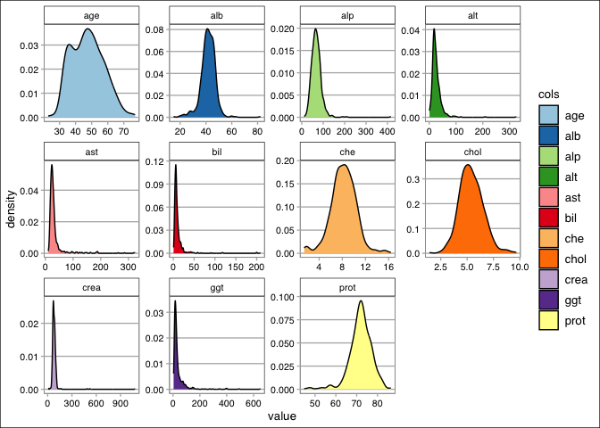

Hepatitis C Virus Clustering via K-Means
================
Rex Manglicmot

-   <a href="#status-continuing-working-document"
    id="toc-status-continuing-working-document">Status: Continuing Working
    Document</a>
-   <a href="#introduction" id="toc-introduction">Introduction</a>
-   <a href="#loading-the-libraries" id="toc-loading-the-libraries">Loading
    the Libraries</a>
-   <a href="#loading-the-data" id="toc-loading-the-data">Loading the
    Data</a>
-   <a href="#cleaning-the-data" id="toc-cleaning-the-data">Cleaning the
    Data</a>
-   <a href="#exploratory-data-analysis"
    id="toc-exploratory-data-analysis">Exploratory Data Analysis</a>
-   <a href="#k-means" id="toc-k-means">K-Means</a>
-   <a href="#limitations" id="toc-limitations">Limitations</a>
-   <a href="#conclusion" id="toc-conclusion">Conclusion</a>
-   <a href="#k-means-references" id="toc-k-means-references">K-Means
    References</a>
-   <a href="#inspirationn-for-this-project"
    id="toc-inspirationn-for-this-project">Inspirationn for this project</a>

## Status: Continuing Working Document

Things to do/Questions:

-   why does the functions summary() and colMeans() have different
    outputs for the mean?

## Introduction

<center>


</center>

Blood is very important as it is used for in medical procedures.
Patients will need blood for surgical procedures (i.e., heart transplant
or car crash trauma), or if someone has an underlying blood-related
disease (i.e., anemia). As such, Twenty-one million of blood components
are transfused in the US/year.[^1]

Organizations like the American Red Cross have championed the notion for
people to donate their blood.[^2] It is therefore important to classify
which blood is suitable for transfusion. Identifying Hepatitis C blood
is important as it may cause the donor to contract the disease.

A special acknowledgement to the University of Irvine’s Data Repository
for hosting a wide range of datasets for the public.[^3] Further,
special acknowledgement to the investigators in creating this dataset;
Ralf Lichtinghagen from the Institute of Clinical Chemistry; Medical
University Hannover from Hannover, Germany, Frank Klawonn from Helmholtz
Centre for Infection Research in Braunschweig, Germany, and Georg
Hoffmann from Trillium GmbH in Grafrath, Germany.

Within the dataset, the target attribute for classification is Category
(blood donors vs. Hepatitis C (including its progress (‘just’ Hepatitis
C, Fibrosis, Cirrhosis).

All attributes except Category and Sex are numerical. The laboratory
data are the attributes 5-14.

The atrributes are as follows:

1.  X (Patient ID/No.)
2.  Category (diagnosis) (values: ‘0=Blood Donor’, ‘0s=suspect Blood
    Donor’, ‘1=Hepatitis’, ‘2=Fibrosis’, ‘3=Cirrhosis’)
3.  Age (in years)
4.  Sex (f,m)
5.  ALB
6.  ALP
7.  ALT
8.  AST
9.  BIL
10. CHE
11. CHOL
12. CREA
13. GGT
14. PROT

## Loading the Libraries

``` r
library(tidyverse)
library(ggthemes)
library(stats)
library(factoextra)
```

## Loading the Data

``` r
#laod data into an url object
url <- ('https://archive.ics.uci.edu/ml/machine-learning-databases/00571/hcvdat0.csv')

#put data into an object
data_orig <- read.csv(url)

#view strucuture
str(data_orig)
```

    ## 'data.frame':    615 obs. of  14 variables:
    ##  $ X       : int  1 2 3 4 5 6 7 8 9 10 ...
    ##  $ Category: chr  "0=Blood Donor" "0=Blood Donor" "0=Blood Donor" "0=Blood Donor" ...
    ##  $ Age     : int  32 32 32 32 32 32 32 32 32 32 ...
    ##  $ Sex     : chr  "m" "m" "m" "m" ...
    ##  $ ALB     : num  38.5 38.5 46.9 43.2 39.2 41.6 46.3 42.2 50.9 42.4 ...
    ##  $ ALP     : num  52.5 70.3 74.7 52 74.1 43.3 41.3 41.9 65.5 86.3 ...
    ##  $ ALT     : num  7.7 18 36.2 30.6 32.6 18.5 17.5 35.8 23.2 20.3 ...
    ##  $ AST     : num  22.1 24.7 52.6 22.6 24.8 19.7 17.8 31.1 21.2 20 ...
    ##  $ BIL     : num  7.5 3.9 6.1 18.9 9.6 12.3 8.5 16.1 6.9 35.2 ...
    ##  $ CHE     : num  6.93 11.17 8.84 7.33 9.15 ...
    ##  $ CHOL    : num  3.23 4.8 5.2 4.74 4.32 6.05 4.79 4.6 4.1 4.45 ...
    ##  $ CREA    : num  106 74 86 80 76 111 70 109 83 81 ...
    ##  $ GGT     : num  12.1 15.6 33.2 33.8 29.9 91 16.9 21.5 13.7 15.9 ...
    ##  $ PROT    : num  69 76.5 79.3 75.7 68.7 74 74.5 67.1 71.3 69.9 ...

## Cleaning the Data

``` r
#make copy for cleaning
data <- data_orig

#view any NAs
sum(is.na(data))
```

    ## [1] 31

``` r
#which rows have NAs
which(is.na(data), arr.ind = TRUE)
```

    ##       row col
    ##  [1,] 604   5
    ##  [2,] 542   6
    ##  [3,] 546   6
    ##  [4,] 547   6
    ##  [5,] 569   6
    ##  [6,] 570   6
    ##  [7,] 571   6
    ##  [8,] 572   6
    ##  [9,] 577   6
    ## [10,] 582   6
    ## [11,] 583   6
    ## [12,] 584   6
    ## [13,] 585   6
    ## [14,] 586   6
    ## [15,] 591   6
    ## [16,] 593   6
    ## [17,] 604   6
    ## [18,] 614   6
    ## [19,] 615   6
    ## [20,] 541   7
    ## [21,] 122  11
    ## [22,] 320  11
    ## [23,] 330  11
    ## [24,] 414  11
    ## [25,] 425  11
    ## [26,] 434  11
    ## [27,] 499  11
    ## [28,] 585  11
    ## [29,] 591  11
    ## [30,] 604  11
    ## [31,] 591  14

``` r
#create dataset to compare with Kmeans that has no NAs
data_orig2 <- data_orig %>%
  drop_na()

#clean data all in one go
data <- data %>%
  #get rid of variables that are not needed for Kmeans via dplyr
  select(-c(X, Category, Sex)) %>% # will try dataframe$column <- NULL next time
  #rename columns to lower case
  rename_all(tolower) %>%
  #deletes NAs
  drop_na()
```

Let’s Explore

## Exploratory Data Analysis

``` r
#show summary statistics of data
summary(data)
```

    ##       age             alb             alp              alt        
    ##  Min.   :23.00   Min.   :14.90   Min.   : 11.30   Min.   :  0.90  
    ##  1st Qu.:39.00   1st Qu.:38.80   1st Qu.: 52.50   1st Qu.: 16.40  
    ##  Median :47.00   Median :41.90   Median : 66.20   Median : 22.70  
    ##  Mean   :47.42   Mean   :41.62   Mean   : 68.12   Mean   : 26.58  
    ##  3rd Qu.:54.00   3rd Qu.:45.10   3rd Qu.: 79.90   3rd Qu.: 31.90  
    ##  Max.   :77.00   Max.   :82.20   Max.   :416.60   Max.   :325.30  
    ##       ast              bil              che              chol      
    ##  Min.   : 10.60   Min.   :  0.80   Min.   : 1.420   Min.   :1.430  
    ##  1st Qu.: 21.50   1st Qu.:  5.20   1st Qu.: 6.930   1st Qu.:4.620  
    ##  Median : 25.70   Median :  7.10   Median : 8.260   Median :5.310  
    ##  Mean   : 33.77   Mean   : 11.02   Mean   : 8.204   Mean   :5.391  
    ##  3rd Qu.: 31.70   3rd Qu.: 11.00   3rd Qu.: 9.570   3rd Qu.:6.080  
    ##  Max.   :324.00   Max.   :209.00   Max.   :16.410   Max.   :9.670  
    ##       crea              ggt             prot      
    ##  Min.   :   8.00   Min.   :  4.5   Min.   :44.80  
    ##  1st Qu.:  68.00   1st Qu.: 15.6   1st Qu.:69.30  
    ##  Median :  77.00   Median : 22.8   Median :72.10  
    ##  Mean   :  81.67   Mean   : 38.2   Mean   :71.89  
    ##  3rd Qu.:  89.00   3rd Qu.: 37.6   3rd Qu.:75.20  
    ##  Max.   :1079.10   Max.   :650.9   Max.   :86.50

``` r
ggplot(gather(data, cols, value), aes(x = value, fill=cols)) + 
       geom_histogram(binwidth = 1) + 
  facet_wrap(.~cols, scales = 'free') + 
  theme_calc() +
  scale_fill_brewer(palette="Paired")
```

<!-- -->

``` r
ggplot(gather(data, cols, value), aes(x = value, fill=cols)) + 
  geom_boxplot() + 
  facet_wrap(.~cols, scales = 'free') + 
  theme_calc() +
  scale_fill_brewer(palette="Paired") 
```

<!-- -->

``` r
ggplot(gather(data, cols, value), aes(x = value, fill=cols)) + 
  geom_density() + 
  facet_wrap(.~cols, scales = 'free') + 
  theme_calc() +
  scale_fill_brewer(palette="Paired") 
```

<!-- -->

## K-Means

<center>


</center>

K-means is a type of unsupervised learning in which observations are
formed into clusters based on k-clusters. If we define K=2 or K=3, there
will be 2 and 3 clusters, respectively. As such, K-means helps us
categorize a dataset without preconceived labels and allow us to uncover
new grouping categories within the dataset. These clusters are based
similarities and differences of the entire dataset.

The K-means algorithmn sets K as centroids which is used to

``` r
#save the labels
data_orig2.labels = data_orig2$Category

#standardize all columns and store into new object
data1 <- data %>%
  mutate_all(~(scale(.) %>%
  as.vector))

#check of the mean is 0
summary(data1)
```

    ##       age                alb                alp                alt         
    ##  Min.   :-2.45865   Min.   :-4.63819   Min.   :-2.19216   Min.   :-1.2307  
    ##  1st Qu.:-0.84759   1st Qu.:-0.49017   1st Qu.:-0.60272   1st Qu.:-0.4877  
    ##  Median :-0.04205   Median : 0.04785   Median :-0.07419   Median :-0.1858  
    ##  Mean   : 0.00000   Mean   : 0.00000   Mean   : 0.00000   Mean   : 0.0000  
    ##  3rd Qu.: 0.66279   3rd Qu.: 0.60324   3rd Qu.: 0.45434   3rd Qu.: 0.2552  
    ##  Max.   : 2.97869   Max.   : 7.04220   Max.   :13.44377   Max.   :14.3183  
    ##       ast                bil                 che                chol         
    ##  Min.   :-0.70505   Min.   :-0.587029   Min.   :-3.09603   Min.   :-3.50886  
    ##  1st Qu.:-0.37341   1st Qu.:-0.334251   1st Qu.:-0.58128   1st Qu.:-0.68324  
    ##  Median :-0.24562   Median :-0.225097   Median : 0.02573   Median :-0.07205  
    ##  Mean   : 0.00000   Mean   : 0.000000   Mean   : 0.00000   Mean   : 0.00000  
    ##  3rd Qu.:-0.06307   3rd Qu.:-0.001044   3rd Qu.: 0.62361   3rd Qu.: 0.61000  
    ##  Max.   : 8.83039   Max.   :11.373971   Max.   : 3.74537   Max.   : 3.78993  
    ##       crea              ggt                prot         
    ##  Min.   :-1.4531   Min.   :-0.62057   Min.   :-5.06464  
    ##  1st Qu.:-0.2696   1st Qu.:-0.41616   1st Qu.:-0.48424  
    ##  Median :-0.0921   Median :-0.28357   Median : 0.03923  
    ##  Mean   : 0.0000   Mean   : 0.00000   Mean   : 0.00000  
    ##  3rd Qu.: 0.1446   3rd Qu.:-0.01102   3rd Qu.: 0.61879  
    ##  Max.   :19.6744   Max.   :11.28314   Max.   : 2.73138

``` r
#colMeans(data1) --> this gives different output? why?

#check if the sd is 1
apply(data1, 2, sd)
```

    ##  age  alb  alp  alt  ast  bil  che chol crea  ggt prot 
    ##    1    1    1    1    1    1    1    1    1    1    1

``` r
# #kmeans and k=5 since there are 5 categories in the dataset
# kresult <- kmeans(data1, 5)
# 
# print(kresult)
```

Insights:

-   5 clusters
-   Means of each cluster in each feature

``` r
# #let compare 
# table(data_orig2$Category, kresult$cluster)
```

``` r
# calc disance between observations
data_dist <-dist(data1)

#calc how many clusters needed via an elbow plot
#method is within Sum Sqaures (wss)
fviz_nbclust(data1, kmeans, method = 'wss') +
  labs(subtitle = 'Elbow Method')
```

<!-- -->

We know that there are 5 clusters of groups. However, when we are
looking at elbow plot (to find the optimal number), we need to look at
diminishing returns and the slope is near zero. Here, it is difficult to
tell, but I think from 4-5 looks good. Let’s choose 5.

``` r
#kmeans with sclaed data, # of centers, and how many random sets to be chosen with nstart
kmeans <-kmeans(data1, center=5, nstart=100)

print(kmeans)
```

    ## K-means clustering with 5 clusters of sizes 207, 166, 195, 18, 3
    ## 
    ## Cluster means:
    ##          age        alb        alp        alt         ast         bil
    ## 1  0.3130408  0.4469508  0.2368245  0.3415397 -0.06828557 -0.12776574
    ## 2  0.6178989 -0.6952008 -0.1370316 -0.3118183 -0.19199226 -0.14089528
    ## 3 -0.9224589  0.2983096 -0.3407192 -0.1078580 -0.08083939 -0.06255888
    ## 4  0.7411009 -1.7397842  1.7304334  0.3066099  3.44891191  3.46571855
    ## 5 -0.2770011 -1.3232473  3.0056722 -1.1411867 -0.10363532 -0.11594278
    ##           che       chol        crea         ggt       prot
    ## 1  0.67641171  0.7659706 -0.01244523  0.07515759  0.4956910
    ## 2 -0.48697918 -0.2216181 -0.14695991 -0.22105638 -0.8064575
    ## 3 -0.09094829 -0.5042631 -0.04959325 -0.22690613  0.2527441
    ## 4 -2.12644196 -1.1330124  0.02044412  3.39060835 -0.6836604
    ## 5 -1.05593636 -1.0139248 12.09139932  1.45116087 -1.9050992
    ## 
    ## Clustering vector:
    ##   [1] 3 3 3 3 3 3 3 3 3 3 3 3 3 3 3 3 3 3 3 3 3 3 3 3 3 3 3 2 3 3 3 3 3 3 3 1 3
    ##  [38] 3 1 3 3 1 3 3 3 1 3 1 3 3 3 3 3 2 1 1 3 1 3 2 1 3 3 3 3 3 3 3 3 3 3 1 3 1
    ##  [75] 3 3 3 1 1 3 3 1 1 2 1 3 3 3 1 1 3 1 1 3 3 1 3 3 1 3 1 2 3 3 1 1 3 1 1 1 1
    ## [112] 1 3 1 1 2 1 2 1 1 3 3 1 3 1 3 3 3 1 3 2 2 1 1 2 3 3 1 1 1 1 1 2 1 3 1 3 2
    ## [149] 2 2 2 3 1 3 3 1 3 1 1 1 3 1 1 2 3 1 3 1 3 3 2 1 1 1 1 2 1 3 2 2 1 1 1 1 1
    ## [186] 2 2 2 1 3 2 3 1 1 1 1 1 2 2 1 2 1 1 1 1 2 2 1 1 3 1 1 3 1 1 1 2 1 1 2 1 2
    ## [223] 1 1 2 1 1 2 3 2 1 1 2 2 1 1 1 1 1 2 1 1 1 1 2 1 1 2 2 2 2 1 1 2 1 2 3 1 1
    ## [260] 1 2 1 1 1 2 2 1 1 2 2 2 1 1 2 1 2 2 2 1 1 1 2 1 1 2 2 1 2 1 2 1 2 1 2 2 1
    ## [297] 2 2 1 1 2 1 1 1 2 1 1 1 2 1 2 2 2 1 2 2 2 3 3 3 3 3 3 3 3 3 3 3 3 3 3 3 3
    ## [334] 3 2 3 3 3 3 3 3 3 3 3 3 3 3 3 3 3 3 3 3 3 3 3 3 1 3 3 3 3 2 3 3 3 3 3 3 1
    ## [371] 3 3 3 2 3 3 2 3 3 1 3 2 3 2 3 2 1 2 3 1 2 1 2 2 2 3 2 2 1 3 2 2 3 1 2 2 2
    ## [408] 2 1 2 3 1 2 1 1 2 2 2 2 2 2 1 2 1 3 2 1 3 2 1 3 2 1 1 1 3 2 2 1 1 2 1 1 1
    ## [445] 2 2 1 2 2 2 2 1 1 1 3 2 1 1 1 2 2 3 1 1 1 1 1 2 1 1 1 2 1 2 1 1 2 2 2 2 1
    ## [482] 1 2 2 1 2 1 2 2 2 2 2 1 1 2 2 2 2 1 2 1 2 2 1 1 1 1 2 2 1 1 1 2 1 2 2 2 2
    ## [519] 1 2 2 2 1 2 1 2 4 2 2 1 2 2 4 3 3 3 3 3 3 3 3 3 1 3 1 1 1 4 4 3 3 2 1 3 3
    ## [556] 3 3 1 3 2 2 3 3 1 2 5 4 4 2 5 4 2 4 4 4 4 2 4 4 4 2 4 5 3 2 4 4 2 4
    ## 
    ## Within cluster sum of squares by cluster:
    ## [1] 1149.83687  895.53301  841.88973 1120.65260   97.34147
    ##  (between_SS / total_SS =  36.5 %)
    ## 
    ## Available components:
    ## 
    ## [1] "cluster"      "centers"      "totss"        "withinss"     "tot.withinss"
    ## [6] "betweenss"    "size"         "iter"         "ifault"

``` r
#plot this bad boy!
# kmeans_clusters <- kmeans$cluster
# rownames(data1) <- data_orig2$Category
```

## Limitations

## Conclusion

## K-Means References

References:

1.  <https://stanford.edu/~cpiech/cs221/handouts/kmeans.html>
    2.https://www.javatpoint.com/k-means-clustering-algorithm-in-machine-learning

## Inspirationn for this project

[^1]: <https://www.redcrossblood.org/donate-blood/blood-donation-process/what-happens-to-donated-blood/blood-transfusions/reasons-transfusions.html#>:\~:text=Blood%20transfusions%20are%20a%20very,in%20the%20United%20States%20alone.

[^2]: <https://www.redcrossblood.org/>

[^3]: <https://archive.ics.uci.edu/ml/datasets/HCV+data>
